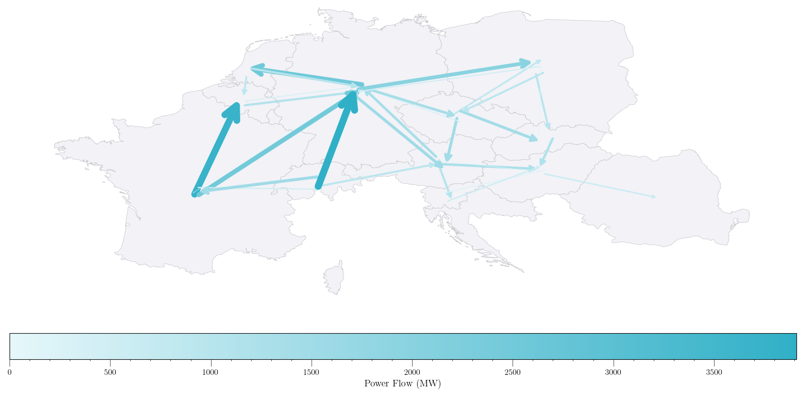

<p align="center">
  
</p>

# Matrix Completion for Panel Data Forecasting

This repository contains the code and data for my master's thesis on using Matrix Completion methods for panel data
forecasting, with a focus on electricity price forecasting.
The dissertation, which includes my results, is available [here](Dissertation_Schnabel.pdf).

## Overview

This project explores the potential of Matrix Completion with Nuclear Norm Minimization (MC-NNM) for panel data
forecasting. It implements and evaluates, for the first time, the autocorrelated errors extension to MC-NNM proposed
by [Athey et al. (2021)](https://doi.org/10.1080/01621459.2021.1891924), demonstrating its benefits in a forecasting
context.
See also my implementation of this estimator [here](https://github.com/tobias-schnabel/mcnnm).

## Key Features

- New open-source Python implementation of MC-NNM with unprecedented flexibility in handling various covariate types
- Implementation of the autocorrelated errors extension (MC-NNM-TSR)
- Comprehensive comparison of MC-NNM against state-of-the-art electricity price forecasting methods
- Novel open-source forecast engine for standardized model comparison
- Rich dataset of European electricity prices for 12 countries retrieved from ENTSOE

## Main Files

- `data_loader.py`: Functions for loading and preprocessing data
- `data_utils.py`: Utility functions for data manipulation
- `estimator.py`: Base class for estimator implementations
- `forecast_engine.py`: Main forecasting engine for model comparison
- `models/`: Folder containing individual model implementations
- `training/`: Scripts for training different models
- `analysis/`: Jupyter notebooks for results analysis and visualization

The forecast engine is designed to be easily customizable and extensible with new models. To add a new model, simply
create a new class in the `models/` folder that inherits from the `Estimator` base class and implements the `fit` and
`predict` methods. It can handle any data, as long as it is passed in the correct format (see the docstrings).

## Replication Instructions

To replicate my results:

1. Download the files in this repository at the
   tag [Submission](https://github.com/tobias-schnabel/mc-forecasting/releases/tag/Submission)

```
wget https://github.com/tobias-schnabel/mc-forecasting/archive/refs/tags/Submission.zip
unzip Submission.zip
cd mc-forecasting-Submission
```

2. Install poetry if not already installed: `pip install poetry`
2. Install dependencies: `poetry install`
3. Run the two notebooks located in the `analysis/` folder to reproduce the tables and figures
4. If you want to rerun the forecasts, which will take several days, you can re-run the forecasting experiments:
    ```bash
   for window in 56 84 112; do
     python training/train_elasticnet_${window}.py
     python training/train_lasso_${window}.py
     python training/train_lear_${window}.py
     python training/train_lear_uv_${window}.py
     python training/train_mc_${window}.py
     python training/train_mctsr_${window}.py
   done

## Contributing

Contributions to improve the code, extend the analysis, or fix bugs are welcome. If you're interested in contributing,
please follow these steps:

1. Fork the repository
2. Create a new branch for your feature (`git checkout -b feature/AmazingFeature`)
3. Make your changes
4. Commit your changes (`git commit -m 'Add some AmazingFeature'`)
5. Push to the branch (`git push origin feature/AmazingFeature`)
6. Open a Pull Request

### Code Style

Please adhere to the PEP 8 style guide for Python code. I recommend using an auto-formatter like `Black` or `ruff` to
ensure consistency.

